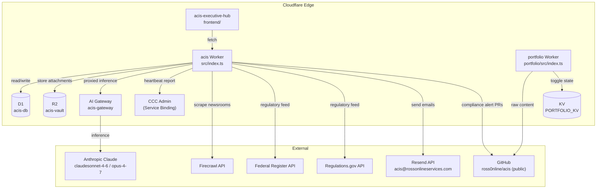

# ACIS Change Impact Map

When you change something, this tells you what else needs attention.

## Dependency Topology



## Change → Impact Table

| If you change… | Also check / update |
|---|---|
| **D1 schema** (`src/db/schema.sql`) | `src/db/queries.ts`, `src/types/index.ts`, affected agents, `ainotebook/` (new ADR or update existing) |
| **`src/types/index.ts`** (Env, data types) | Any file that imports those types; run `npx tsc --noEmit` |
| **`src/index.ts`** (routes, cron) | `CLAUDE.md` cron sequence, `ainotebook/008`, `memory/post_compaction_review.md` |
| **Scraper agent** (`src/agents/scraper.ts`) | Frontend `LivePulse.tsx` if response shape changes; ADR 008 run counts |
| **Vendor scanner** (`src/agents/vendor-scanner.ts`) | `VendorBoard.tsx`, `src/db/queries.ts` (updateVendorScan), ADR 003/008 |
| **Heartbeat agent** (`src/agents/heartbeat.ts`) | `OperationsPanel.tsx` (HeartbeatReport type), CCC Admin status endpoint, ADR 007/008 |
| **Email agents** (`src/agents/attestation-reminder.ts`, `incident-escalation.ts`) | `src/services/email.ts`, `src/types/index.ts` (RESEND_API_KEY), ADR 016 |
| **`src/services/email.ts`** | Both email agents; test against Resend sandbox |
| **`frontend/src/types.ts`** (API response types) | All frontend components that use those types |
| **Frontend component** (`frontend/src/components/`) | Check the tab it lives under in `App.tsx`; build + deploy Pages |
| **`frontend/index.html`** or `App.tsx` | Rebuild frontend; `acis-deploy` or manual `npm run build` + Pages deploy |
| **Portfolio Worker** (`portfolio/src/index.ts`) | `portfolio/wrangler.toml` if routes/bindings change; `portfolio-deploy` after push |
| **`docs/brms/`** (any file) | Push to GitHub first (`git push`), then verify at `portfolio.rossonlineservices.com` |
| **Worker secrets** (add/remove) | `.dev.vars`, `CLAUDE.md` secrets table, `memory/scripts_reference.md`, `acis-secrets-check` |
| **`wrangler.toml`** bindings | `src/types/index.ts` Env interface; redeploy Worker |
| **Cron schedule** (`wrangler.toml` crons) | `CLAUDE.md` cron section, `ainotebook/008`, `memory/post_compaction_review.md` |
| **New AI agent** | `src/index.ts` (register route + cron), `ainotebook/` (new ADR), ADR 008 (module status), `CLAUDE.md`, `memory/post_compaction_review.md`, `frontend/` (if new UI panel) |
| **New npm package** | `package.json`, `package-lock.json`; check Workers compatibility (`nodejs_compat`) |
| **CCC Admin integration changes** | `src/index.ts` `/api/status` route, CCC Admin Worker, heartbeat format |

## CCC Admin Touch Points

CCC Admin receives heartbeat reports via service binding and polls `/api/status` for live module counts. Changes that affect CCC Admin:

- Heartbeat report shape (`HeartbeatReport` type in `src/types/index.ts`)
- `/api/status` route output shape — CCC Admin dashboard `AcisStatusCard` depends on it
- Service binding name `CCC_ADMIN` in `wrangler.toml`

## Deploy Sequence Reminders

```
ACIS full deploy:     acis-deploy
Portfolio deploy:     portfolio-deploy   ← push to GitHub FIRST (content fetched at runtime)
Secrets audit:        acis-secrets-check
Manual agent trigger: acis-trigger <scraper|heartbeat|vendors|demo-pr>
```
