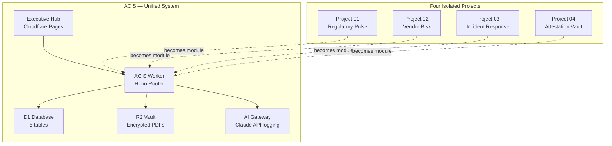

# 001 — Four Projects → One System

**Date:** 2026-04-25  
**Status:** Decided

---

## The Decision

Consolidate the original four portfolio projects into a single unified system: **ACIS (Autonomous Compliance Intelligence System)**, with each original project becoming a module.

## The Original Plan

Four separate projects, each with its own repo, Worker, and dashboard:

```
Project 01 — Regulatory Pulse Dashboard
Project 02 — Automated Vendor Risk Assessor
Project 03 — Incident Response Auto-Playbook & Tracker
Project 04 — Gag Clause & RxDC Attestation Vault
```

## Why It Changed

Building four isolated systems creates a portfolio that shows breadth but not depth. The BRMS job description asks for someone who can manage a compliance *program* — not four disconnected tools. A unified system that shows all four domains operating together under one architecture communicates program-level thinking, not task-level execution.

The other driver: integration debt. Four separate Workers, four D1 databases, four dashboards — stitched together later — would require rewiring the foundation after the fact. One schema, one deployment, one dashboard with four panels is architecturally cleaner and far more impressive to a technical reviewer.



## What Each Module Maps To

| Original Project | ACIS Module | D1 Table | Executive Hub Panel |
|---|---|---|---|
| Regulatory Pulse Dashboard | `src/modules/regulatory.ts` | `regulatory_events` | Live Pulse |
| Vendor Risk Assessor | `src/modules/vendor.ts` | `vendor_risk` | Vendor Risk Board |
| Incident Response Playbook | `src/modules/incidents.ts` | `incidents` | Incident Tracker |
| RxDC Attestation Vault | `src/modules/attestation.ts` | `attestation_vault` | Attestation Status |

The individual `CHARTER.md` files in `projects/` remain as planning documents and requirement maps. They describe *what* each module must do; the code in `src/modules/` is *how* it does it.

## The CCC Admin Relationship

ACIS is Project #2 in the CCC (Compliance Command Center) meta-system. CCC Admin (`ccc-admin`) is the global registry that tracks ACIS's module status, deployment state, and activity log. ACIS Workers report to CCC Admin via Service Bindings whenever a meaningful state change occurs (new regulatory event ingested, attestation status updated, incident opened).

This means the hiring manager demo has two layers: ACIS at `acis.rossonlineservices.com` showing the compliance operations center, and CCC Admin at `dashboard.rossonlineservices.com` showing the meta-system that manages ACIS itself. The latter demonstrates the kind of operational awareness that distinguishes a program manager from a project executor.
