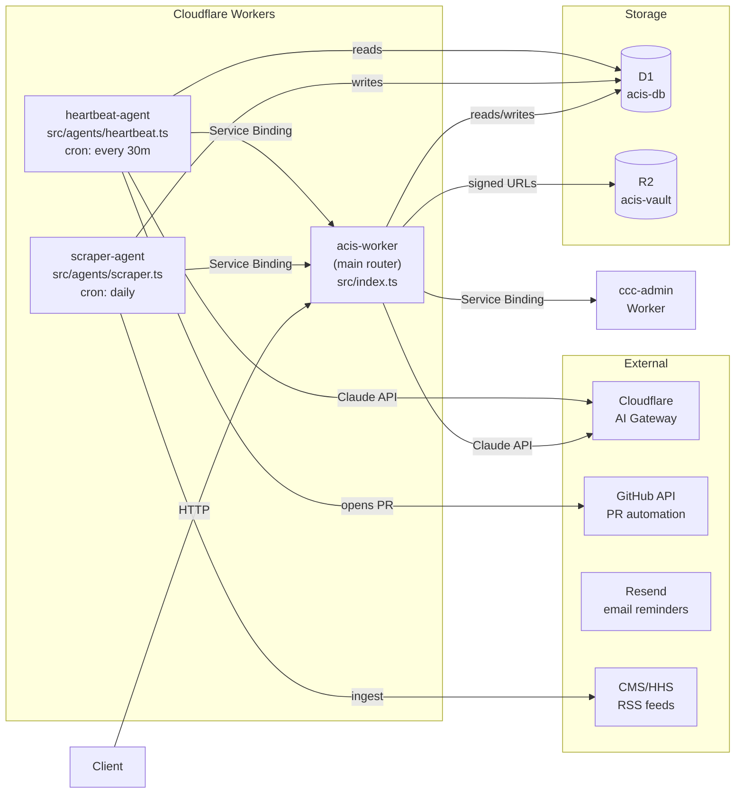

# 002 — Unified Worker vs Microservices

**Date:** 2026-04-25  
**Status:** Decided

---

## The Decision

One primary ACIS Worker handling all module routes, with agents (scraper, heartbeat) as separate Workers bound via Service Bindings. Not four independent Workers with their own deployments.

## The Architecture



## Why Not Four Separate Workers

Four Workers means four `wrangler.toml` files, four deployment pipelines, four sets of D1 bindings pointing at the same database, and four places to update when a shared type changes. The modules share the same D1 schema — separating their compute while keeping their storage unified creates artificial complexity.

The router pattern (Hono) already gives clean module separation within one Worker. A route prefix per module (`/regulatory/*`, `/vendor/*`, `/incidents/*`, `/attestation/*`) is as clean as four Workers but with zero coordination overhead.

## Why Agents Are Separate

The scraper and heartbeat agents run on cron triggers, not HTTP triggers. Cloudflare Workers supports cron on any Worker, but separating them makes their purpose explicit and lets them have different CPU time limits and memory profiles than the main API Worker. They communicate back to the main Worker via Service Bindings when they need to trigger side effects (e.g., the scraper reporting a high-risk regulatory event so the main Worker can log it to CCC Admin).

## The Folder Structure This Creates

```
compliance-portfolio/
├── src/
│   ├── index.ts           ← main Hono router (HTTP entrypoint)
│   ├── agents/
│   │   ├── scraper.ts     ← cron Worker: CMS/HHS RSS ingestion
│   │   └── heartbeat.ts   ← cron Worker: self-audit + GitHub PR
│   ├── modules/
│   │   ├── regulatory.ts  ← /regulatory routes + Claude risk scoring
│   │   ├── attestation.ts ← /attestation routes + Resend reminders
│   │   ├── vendor.ts      ← /vendor routes + TLS/header scan
│   │   └── incidents.ts   ← /incidents routes + NIST playbook gen
│   ├── db/
│   │   └── queries.ts     ← typed D1 query functions
│   └── types/
│       └── index.ts       ← shared TypeScript interfaces
├── db/
│   └── schema.sql         ← D1 migration (all 5 tables)
└── frontend/              ← Cloudflare Pages (Executive Hub)
    └── src/
```
