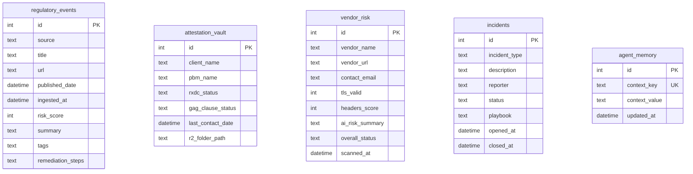

# 003 — D1 Schema: Five-Table Design

**Date:** 2026-04-25  
**Status:** Decided

---

## The Decision

Five tables in a single D1 database (`acis-db`): `regulatory_events`, `attestation_vault`, `vendor_risk`, `incidents`, `agent_memory`.

## Schema

## Key Design Decisions

### 1. `remediation_steps` as JSON string
The regulatory analyst sub-agent outputs structured JSON: `{ risk_level, impacted_field, summary, remediation_step, deadline }`. This is stored as a TEXT blob in `remediation_steps` rather than discrete columns. Rationale: Claude's output format may evolve, and storing it as a string avoids schema migrations every time the prompt changes. A `deadline DATE` column can be added via migration in Phase 2 if deadline-based queries become necessary.

### 2. `ai_risk_summary` on `vendor_risk` — same pattern
Claude's vendor analysis output (TLS grade, missing security headers, HIPAA BAA status, recommended action) is JSON-in-TEXT. Same reasoning as above.

### 3. `playbook` on `incidents` stores the NIST 800-61 playbook
When an incident is created, the NIST playbook generation runs and the output (a structured JSON with detection, containment, eradication, and recovery steps) is stored here. The playbook is append-only — new entries, never updates.

### 4. `agent_memory` as key-value state
The scraper agent needs cross-run state: "what was the last URL I saw from CMS.gov?" Without persistent memory, every cron run would re-ingest the same regulatory events. `agent_memory` provides a simple key-value store at the D1 layer. The Cloudflare Agents SDK (Durable Objects) provides richer stateful memory for the heartbeat agent; `agent_memory` is the lightweight fallback for the scraper.

### 5. No foreign keys across tables
The five tables represent distinct domains. An incident doesn't belong to a vendor; a regulatory event doesn't belong to an attestation client. Forcing foreign key relationships across these domains would couple modules that should remain independent. The only shared context is the `agent_memory` table, which all agents can read and write.

## What This Intentionally Omits

No `users` or `auth` table — ACIS is a single-admin system. Authentication is handled at the Worker layer via the `ADMIN_TOKEN` secret (same pattern as CCC Admin). The database layer has no auth logic.
