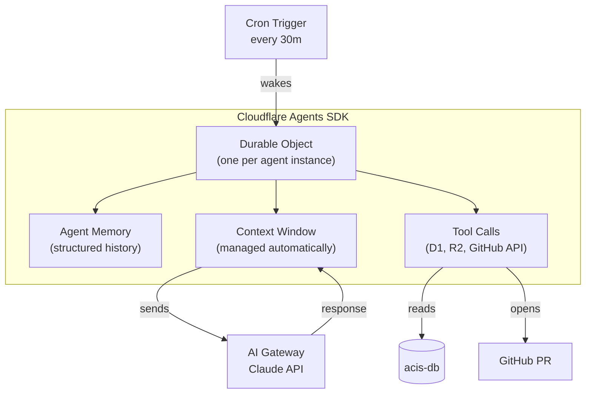

# 004 — Cloudflare Agents SDK for Stateful Memory

**Date:** 2026-04-25  
**Status:** Decided

---

## The Decision

Use the **Cloudflare Agents SDK** (`cloudflare/agents`) for the heartbeat agent's stateful memory, rather than vanilla Durable Objects or pure D1 state.

## What the Problem Is

The heartbeat agent runs every 30 minutes. Its job: read ACIS's own error rates and recent agent activity, reason about system health with Claude, and open a GitHub PR if the analysis suggests a code change is needed. To do this meaningfully, it needs memory that spans runs:

- "I already opened a PR for this error pattern — don't open another"
- "The regulatory scraper has failed 3 times in the last 6 hours — escalate"
- "I last recommended caching regulatory events; the latency improved — remember this"

Without persistent state, each run is blind to prior runs. With D1 alone, you can persist state but you get no structured agent lifecycle — just raw SQL reads and writes with no framework for managing conversation history, tool call results, or reasoning traces.

## What the Agents SDK Provides

The SDK manages the Durable Object lifecycle, serializes the conversation history across runs, handles context window truncation, and provides typed tool definitions. It's essentially what you'd build yourself using vanilla Durable Objects — but without the boilerplate.

## Why Not Vanilla Durable Objects

Vanilla Durable Objects give you a persistent JavaScript object with storage. That's the primitive. Building an agent on top requires: serializing message history, managing context length, handling tool call/result pairs, wiring up the Claude API, and managing state after each turn. The Agents SDK does all of this. Using vanilla DOs here would be rebuilding the SDK without the benefit of it.

The exception: the scraper agent uses simple D1 key-value state via `agent_memory` because its state is minimal (last-seen URL per source, last run timestamp). It doesn't need a full agent lifecycle.

## The "Brain Log" Demo Value

The Agents SDK gives us something that vanilla automation can't: a visible reasoning trace. Each heartbeat run appends to the agent's history. The Executive Hub "Agent Logs" panel surfaces this history — actual Claude reasoning steps, tool calls made, decisions reached — making the AI's behavior transparent and auditable.

For a compliance role, **auditable AI decision-making** is exactly the right thing to demonstrate. A hiring manager reviewing the dashboard sees not just outputs but the reasoning chain that produced them. That's a fundamentally different claim than "I built a chatbot."

## The Tradeoff

The Agents SDK is relatively new (2025). It's stable but the API may evolve. Binding it tightly to the heartbeat agent rather than all of ACIS limits exposure — if the SDK changes significantly, only the heartbeat agent needs updating, not the entire codebase.
