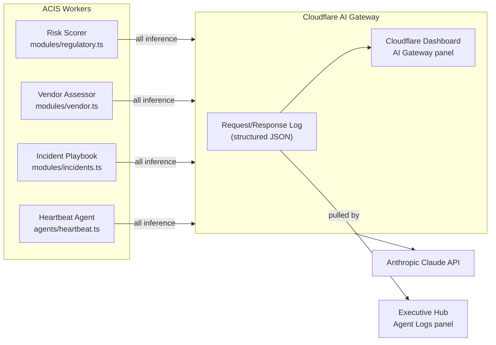

# 005 — AI Gateway as Observability Layer

**Date:** 2026-04-25  
**Status:** Decided

---

## The Decision

All Claude API calls from ACIS Workers route through the Cloudflare AI Gateway (`acis-gateway`) rather than calling the Anthropic API directly.

## The Gateway URL

```
https://gateway.ai.cloudflare.com/v1/384fc5d6758abeb5f11df18f963eac5d/acis-gateway/anthropic
```

This was established during CCC Admin setup (see `ccc-admin/ainotebook/007-ai-gateway-rest-api.md`). The gateway was configured with `collect_logs: true`, no caching (regulatory data must always be fresh), and no rate limiting (appropriate for development).

## Why This Matters Beyond Cost

The standard reason to use an AI Gateway is cost reduction through caching and rate limiting. That's not the primary driver here — caching is disabled because regulatory data should always reflect the latest Claude analysis, not a cached response from 2 hours ago.

The primary driver is **observability for the demo**:



Every Claude inference call — risk scoring a regulatory event, generating a NIST playbook, analyzing a vendor's security posture, the heartbeat agent's self-audit — is logged in the gateway with the full request and response. The Executive Hub's "Agent Logs" panel pulls from this log and renders it as a human-readable reasoning trace.

## What the Hiring Manager Sees

The Agent Logs panel shows something like:

```
[10:23:14] REGULATORY RISK SCORE
  Input: CMS bulletin re: RxDC reporting deadline extension
  Output: { risk_level: "High", impacted_field: "RxDC", 
            summary: "Deadline extended 60 days — update tracking",
            remediation_step: "Update attestation_vault deadlines" }

[10:25:02] VENDOR RISK ASSESSMENT  
  Input: Vendor "MedPharm Solutions" — TLS valid, missing CSP header
  Output: { overall_status: "Requires Review", 
            ai_risk_summary: "Missing Content-Security-Policy..." }
```

This is the difference between a system that does compliance work and a system that shows its work. The latter is what the "Autonomous" in ACIS means — not just automated, but transparently reasoned.

## Implementation Note

All Workers set the Anthropic base URL to the gateway URL when initializing the Anthropic SDK client:

```typescript
const anthropic = new Anthropic({
  apiKey: env.ANTHROPIC_API_KEY,
  baseURL: env.AI_GATEWAY_URL,
});
```

`AI_GATEWAY_URL` is a `[vars]` entry in `wrangler.toml` (not a secret — the URL is not sensitive). `ANTHROPIC_API_KEY` is a Wrangler encrypted secret.
