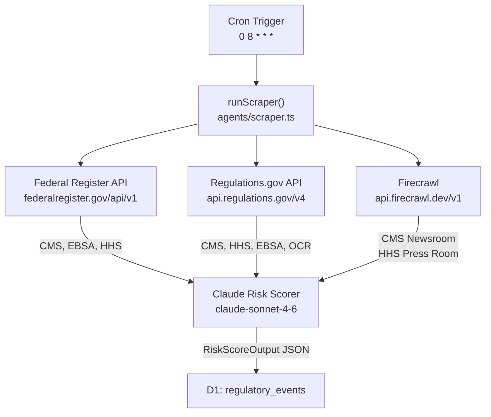

# 006 — Regulatory Ingestion: Three-Source Architecture

**Date:** 2026-04-25  
**Status:** Decided & Implemented

---

## The Decision

ACIS pulls regulatory intelligence from three distinct source types, each filling a different gap in the compliance information landscape. A single source was insufficient — the types of content, access methods, and urgency signals differ too much.



## Source 1: Federal Register API

**What it covers:** Formal regulatory actions — proposed rules, final rules, interim final rules, notices. These are the documents compliance administrators are *legally required to respond to*.

**Why it's the authoritative backbone:** Federal Register filings represent the regulatory record. A final rule in the Federal Register has the force of law. A CMS press release does not. For a compliance demo, Federal Register content is more credible than scraped news because it's the actual regulatory text.

**Access:** Open JSON API, no authentication required, no rate limits for reasonable use.

**Sources pulled:**
- `centers-for-medicare-medicaid-services` — CMS formal rulemaking
- `employee-benefits-security-administration` — EBSA/DOL filings (CAA, ERISA)
- `health-and-human-services-department` — HHS department-wide notices

## Source 2: Regulations.gov API

**What it covers:** Active rulemaking dockets — documents currently open for public comment. These are the highest-urgency items for a compliance administrator because they have hard deadlines and represent the government's stated intent to change the rules.

**The key signal:** `commentEndDate` — a real, enforceable deadline. ACIS enforces a minimum Medium (5) risk score on any document with an open comment period. This is an explicit policy decision: if the government is actively soliciting comment, it warrants at minimum a Medium alert regardless of how Claude assesses the content.

**Access:** Free API key from api.data.gov. Key stored as Wrangler encrypted secret `REGULATIONS_GOV_API_KEY`.

**Agencies pulled:** CMS, HHS, EBSA, OCR — the four agencies with the highest direct compliance relevance for health plan administrators.

## Source 3: Firecrawl (Press Releases & Fact Sheets)

**What it covers:** Informal guidance, press releases, fact sheets, news alerts. These don't have the legal force of Federal Register filings but often signal enforcement priorities, upcoming deadlines, and agency interpretation of existing rules.

**Why a third-party service is necessary:** Both CMS.gov (Cloudflare Bot Fight Mode) and HHS.gov (Akamai Bot Manager) block automated requests. Standard `fetch()` returns challenge pages. See ADR-007 for the full investigation.

**Access:** Firecrawl managed scraping API. Key stored as `FIRECRAWL_API_KEY` secret. Gracefully skipped if key is absent (`if (env.FIRECRAWL_API_KEY)`).

## The Claude Layer

Every document from every source passes through the same scoring function regardless of origin:

```typescript
{
  risk_level: "High" | "Medium" | "Low",
  impacted_field: "RxDC" | "GagClause" | "HIPAA" | "GeneralSecurity" | "Other",
  summary: "one sentence for a compliance administrator",
  remediation_step: "one specific action",
  deadline: "YYYY-MM-DD or empty string"
}
```

This normalized output means the Executive Hub's Live Pulse panel can render all sources identically. The source field (`CMS`, `REG-GOV/CMS`, `CMS-News`) tells the administrator where to look for the authoritative document.

## Deduplication

All three source types check for URL existence before inserting. The Federal Register and Regulations.gov use canonical URLs (`html_url`, `regulations.gov/document/{id}`). Firecrawl sources use the article permalink extracted by Claude from the newsroom markdown. Duplicate runs are safe — the scraper is idempotent.

## Cron Schedule

`0 8 * * *` — 8:00 AM UTC daily. Selected to run before US business hours start (3–4 AM Eastern) so compliance staff see fresh data when they open their dashboards in the morning.
