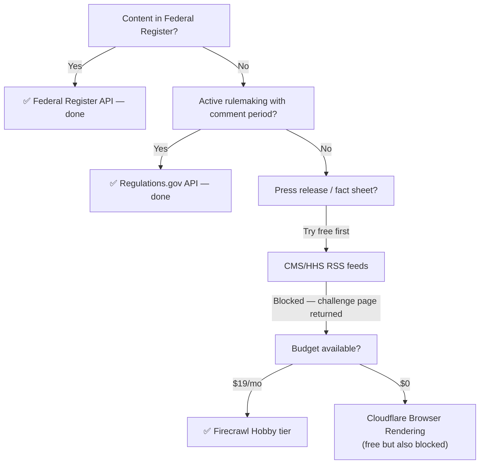

# 007 — Bypassing Bot Protection on CMS.gov and HHS.gov

**Date:** 2026-04-25  
**Status:** Decided & Implemented

---

## The Problem

CMS.gov and HHS.gov are the two primary direct sources for informal compliance guidance — press releases, fact sheets, news alerts. Both block automated requests:

- **CMS.gov** — Protected by Cloudflare Bot Fight Mode. Returns an HTML challenge page to any non-browser client, including standard `fetch()` from a Cloudflare Worker.
- **HHS.gov** — Protected by Akamai Bot Manager. Returns "Access Denied" to automated user agents.

This matters because press releases and fact sheets are how agencies communicate enforcement priorities and upcoming deadlines *before* formal rulemaking begins. They are the early warning signal.

## Options Investigated



**Cloudflare Browser Rendering** (`@cloudflare/puppeteer`) was the first instinct — we're already on Cloudflare, it's free up to 10min/day. Rejected: it uses a fixed User-Agent `CloudflareBrowserRenderingCrawler/1.0` which CMS.gov's own Cloudflare instance trivially blocks. One Cloudflare product cannot bypass another Cloudflare product's bot protection by design.

**Correct RSS URLs** — the original scraper attempt used wrong RSS paths. Tested the correct ones (`cms.gov/newsroom/press-releases.rss`, `hhs.gov/guidance/document/rss-feeds-and-podcasts`). Both return HTML challenge pages regardless of path. The bot protection operates at the domain level, not the path level.

**Firecrawl** — managed scraping API with rotating proxies and stealth headers. Has an official MCP server for development-time use. Confirmed working against both targets:
- `cms.gov/newsroom` → returns full press release listing as clean markdown ✅
- `hhs.gov/press-room/index.html` → returns press room content ✅

## Implementation

Firecrawl is called via REST API directly (not npm SDK) to avoid any bundling uncertainty in the Worker:

```typescript
const resp = await fetch('https://api.firecrawl.dev/v1/scrape', {
  method: 'POST',
  headers: {
    'Authorization': `Bearer ${env.FIRECRAWL_API_KEY}`,
    'Content-Type': 'application/json',
  },
  body: JSON.stringify({
    url: feed.url,
    formats: ['markdown'],
    onlyMainContent: true,
  }),
});
```

The response is raw markdown of the newsroom listing page. Claude then parses that markdown into structured articles (title, url, date, type) in a single call — one Firecrawl credit per source per day, plus one Claude call for parsing, then individual scoring calls per article.

## Graceful Degradation

The Firecrawl block is wrapped in `if (env.FIRECRAWL_API_KEY)`. If the key is absent or the free tier is exhausted, the scraper continues with Federal Register + Regulations.gov. Press releases are supplementary — the system does not degrade in correctness without them, only in coverage breadth.

## Cost at Scale

Free tier: 500 credits one-time. Two sources × 1 credit/day = ~250 days before exhaustion.  
Hobby tier ($19/mo): 3,000 credits/month. At 60 credits/month for this workload, effectively unlimited.

## What This Demonstrates to a Hiring Manager

The decision tree documented here — try free options first, understand why each fails technically, select the appropriate paid tool only when necessary — is the same reasoning a compliance architect uses when evaluating security tooling. It's not just that it works; it's that the path to making it work is documented and defensible.
