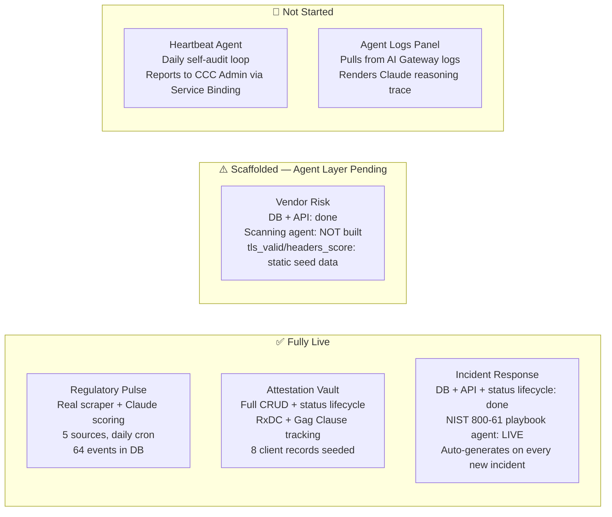

# 008 — Current Build State & Remaining Roadmap

**Date:** 2026-04-25 (updated 2026-04-25)  
**Status:** Reference — updated as phases complete

---

## What Is Actually Built vs. Pending

---

## Regulatory Pulse — Complete

- Cron scraper runs daily at 08:00 UTC
- Five source pipelines: Federal Register (CMS, EBSA, HHS), Regulations.gov (CMS, HHS, EBSA, OCR), Firecrawl (CMS Newsroom, HHS Press Room)
- Claude scores every document: risk level, impacted field, summary, remediation step, deadline
- Deduplication by URL — idempotent runs
- Open comment periods enforce minimum Medium (5) risk score
- Manual trigger: `POST /api/scraper/run` (admin auth)

## Attestation Vault — Complete

- Full CRUD for client plan records
- Two compliance dimensions tracked per client: `rxdc_status`, `gag_clause_status`
- `GET /api/attestation` returns completion percentages
- R2 folder path stored per record for future document upload integration

## Incident Response — Complete (see ADR 009)

- Full CRUD + status lifecycle (Open → Contained → Remediated → Closed)
- `POST /api/incidents` auto-generates a NIST 800-61 playbook via Claude before returning
- `POST /api/incidents/:id/playbook` regenerates playbook on demand
- Playbook structure: severity, HIPAA reportability, 60-day OCR deadline, 5 NIST phases, CFR citations, escalation contacts
- Executive Hub renders full `PlaybookView` with semantic color-coding per phase

## Vendor Risk — DB + API Only

The POST handler accepts full field payloads. But there is no active scanning agent — `tls_valid`, `headers_score`, and `ai_risk_summary` are set via seeded data, not computed.

**What the scanning agent needs to do (next phase):**
1. `fetch()` the vendor URL, check TLS via response metadata
2. Inspect response headers (HSTS, CSP, X-Frame-Options, X-Content-Type-Options)
3. Compute a 0–100 `headers_score`
4. Pass findings to Claude for `ai_risk_summary` and `overall_status`
5. Store results and update the record

---

## Seeded Demo Data (current)

| Module | Records | Notes |
|---|---|---|
| Regulatory Events | 64 | Real federal data, Claude-scored, 5 sources |
| Attestation | 8 clients | Realistic mix of statuses |
| Vendor Risk | 6 vendors | Change Healthcare correctly flagged High Risk |
| Incidents | 7 incidents | Full status range + AI playbooks on new records |

---

## Remaining Build Order

1. **Vendor scanner agent** — real computed TLS/headers scores, Claude risk summary; makes Vendor Risk panel genuinely functional and demo-credible
2. **Heartbeat agent** — daily self-audit loop, reports system health to CCC Admin via Service Binding; this is the "autonomous" in ACIS
3. **Agent Logs panel** — pulls AI Gateway request log, renders Claude reasoning trace in the Executive Hub; closes the observability story
