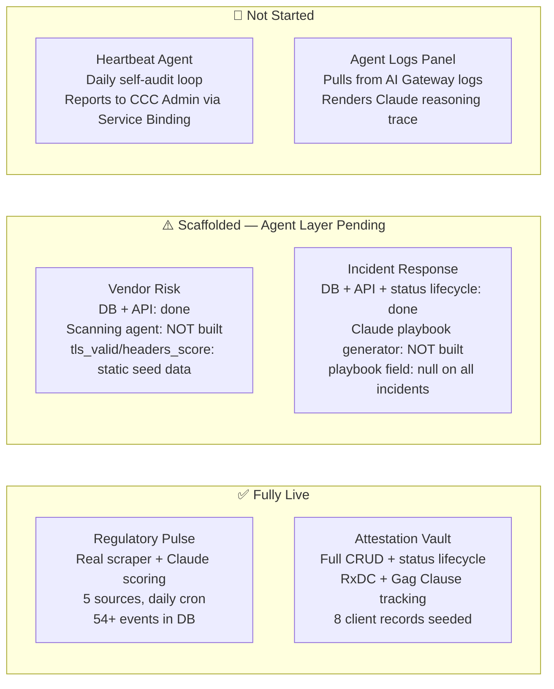

# 008 — Current Build State & Remaining Roadmap

**Date:** 2026-04-25  
**Status:** Reference — updated as phases complete

---

## What Is Actually Built vs. Scaffolded

This ADR exists to prevent the demo from overpromising. Every module has a DB schema and API routes. Not every module has its AI agent layer implemented yet.

## Regulatory Pulse — Complete

- Cron scraper runs daily at 08:00 UTC
- Three source types: Federal Register API, Regulations.gov API, Firecrawl
- Claude scores every document: risk level, impacted field, summary, remediation step, deadline
- Deduplication by URL — idempotent runs
- Open comment periods enforce minimum Medium (5) risk score
- Manual trigger: `POST /api/scraper/run` (admin auth)

## Attestation Vault — Complete (UI layer pending)

- Full CRUD for client plan records
- Two compliance dimensions tracked per client: `rxdc_status`, `gag_clause_status`
- `GET /api/attestation` returns completion percentages (rxdc_completion_pct, gag_clause_completion_pct)
- R2 folder path stored per record for future document upload integration
- No document upload UI yet — that's a future phase

## Vendor Risk — DB + API Only

The POST handler now accepts full field payloads (fixed 2026-04-25 — was hardcoding Pending Review). But there is no active scanning agent. `tls_valid`, `headers_score`, and `ai_risk_summary` are set manually or via seeding — not computed.

**What the scanning agent needs to do (next phase):**
1. `fetch()` the vendor URL, check TLS via response metadata
2. Inspect response headers for HSTS, CSP, X-Frame-Options, X-Content-Type-Options
3. Compute a 0–100 `headers_score` from present/absent headers
4. Pass findings to Claude for `ai_risk_summary` and `overall_status`
5. Store results and update the record

## Incident Response — DB + API + Status Lifecycle Only

The POST handler now accepts `status` from the request (fixed 2026-04-25 — was hardcoding Open). But there is no Claude playbook generator. The `playbook` field is null for all incidents.

**What the playbook generator needs to do (next phase):**
1. On `POST /api/incidents`, detect `incident_type`
2. Call Claude with NIST 800-61 and HIPAA Breach Notification Rule context
3. Generate a step-by-step response playbook appropriate to the incident type
4. Store as `playbook` JSON on the incident record
5. Surface in the Incidents panel as an expandable "Response Steps" section

## Seeded Demo Data (as of 2026-04-25)

| Module | Records | Notes |
|---|---|---|
| Regulatory Events | 54+ | Real federal data, Claude-scored |
| Attestation | 8 clients | Realistic mix of statuses |
| Vendor Risk | 6 vendors | Change Healthcare correctly flagged High Risk |
| Incidents | 6 incidents | Full status range: Open, Contained, Remediated, Closed |

## Remaining Build Order

1. **Vendor scanner agent** — adds real computed security scores, makes the Vendor Risk panel genuinely functional
2. **Incident playbook generator** — Claude generates NIST-aligned playbooks on incident creation
3. **Heartbeat agent** — daily self-audit loop, reports system health to CCC Admin via Service Binding
4. **Agent Logs panel** — pulls AI Gateway request log, renders Claude reasoning trace in the Executive Hub

Items 3 and 4 are what elevate ACIS from "compliance tracker with AI" to "autonomous compliance intelligence system." They are the architectural centerpiece of the portfolio narrative.
