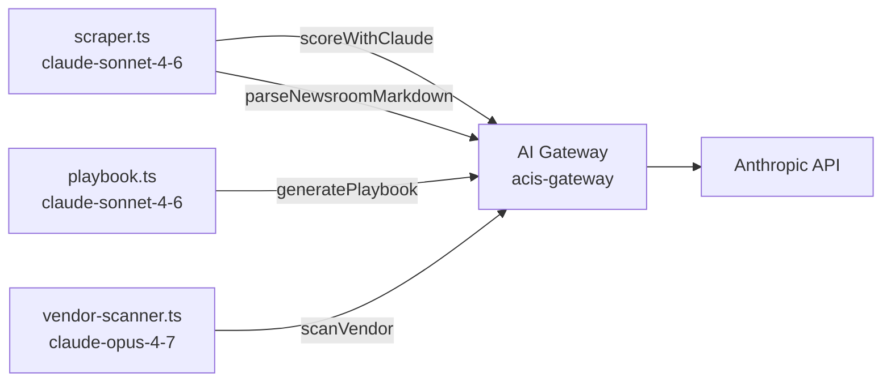

# 011 — Claude API Usage Inventory

**Date:** 2026-04-25  
**Status:** Reference — updated as agents are added or models change

---

## Current API Surface

All Claude calls go through the Cloudflare AI Gateway (`acis-gateway`) via the `AI_GATEWAY_URL` env var set as the `baseURL` on the Anthropic client. This gives request logging, latency tracking, and cost visibility across every agent.

---

## Agent Inventory

### `src/agents/scraper.ts` — `claude-sonnet-4-6`

**Call 1 — `scoreWithClaude()`**  
Scores a single regulatory document against HIPAA/compliance frameworks.  
- Input: title, summary, source, URL (truncated to 300 chars)  
- Output: `RiskScoreOutput` — `risk_level`, `impacted_field`, `summary`, `remediation_step`, `deadline`  
- `max_tokens: 512`  
- Called once per document ingested; volume scales with cron run (typically 10–30 calls/day)

**Call 2 — `parseNewsroomMarkdown()`**  
Extracts structured article objects from raw Firecrawl markdown dumps of CMS and HHS press rooms.  
- Input: full markdown page content (truncated to 8,000 chars), source label  
- Output: `ParsedNewsItem[]` — `title`, `url`, `published_date`, `summary`  
- `max_tokens: 2048`  
- Called twice per cron run (once per Firecrawl source: CMS Newsroom, HHS Press Room)

---

### `src/agents/playbook.ts` — `claude-sonnet-4-6`

**Call — `generatePlaybook()`**  
Generates a structured NIST SP 800-61 Rev 2 incident response playbook.  
- Input: `incident_type`, `description` (truncated to 800 chars), `reporter`  
- Output: `IncidentPlaybook` — severity, HIPAA reportability, OCR deadline, 5 NIST phases, CFR citations, escalation contacts  
- `max_tokens: 2048`  
- Called synchronously on every `POST /api/incidents`; also on `POST /api/incidents/:id/playbook` (admin-triggered regeneration)  
- See ADR 009 for design rationale

---

### `src/agents/vendor-scanner.ts` — `claude-opus-4-7`

**Call — `scanVendor()`**  
Assesses vendor security posture as a HIPAA Business Associate.  
- Input: vendor name, URL, TLS valid flag, headers_score (0–100), lists of headers present/missing  
- Output: `ai_risk_summary` (2–3 sentences), `overall_status` (Approved / Requires Review / High Risk / Pending Review)  
- `max_tokens: 512`  
- Called on `POST /api/vendors/:id/scan` and for each vendor in `POST /api/vendors/scan-all`  
- See ADR 010 for design rationale

---

## Model Version Gap

The scraper and playbook agents were written before the `/claude-api` skill established `claude-opus-4-7` as the default for new agent code. The vendor scanner (written after) uses `claude-opus-4-7`.

| Agent | Model | Upgrade Candidate? |
|---|---|---|
| scraper — scoreWithClaude | claude-sonnet-4-6 | Low priority — classification task; Sonnet is cost-appropriate for high-volume document scoring |
| scraper — parseNewsroomMarkdown | claude-sonnet-4-6 | Low priority — structured extraction; Sonnet handles it well |
| playbook — generatePlaybook | claude-sonnet-4-6 | Medium — HIPAA regulatory accuracy would benefit from Opus depth; upgrade when next touching incidents |
| vendor-scanner — scanVendor | claude-opus-4-7 | Current |

---

## Cost Profile (estimated, daily cron)

| Agent | Calls/Day | Model | Input est. | Output est. |
|---|---|---|---|---|
| scoreWithClaude | ~20 | Sonnet 4.6 | ~15K tokens | ~5K tokens |
| parseNewsroomMarkdown | 2 | Sonnet 4.6 | ~16K tokens | ~2K tokens |
| generatePlaybook | on incident creation (rare) | Sonnet 4.6 | ~1K tokens | ~2K tokens |
| scanVendor | on demand only | Opus 4.7 | ~0.5K tokens | ~0.2K tokens |

Daily cron cost is dominated by the scraper. On-demand costs (playbook, vendor scan) are negligible at demo scale.
