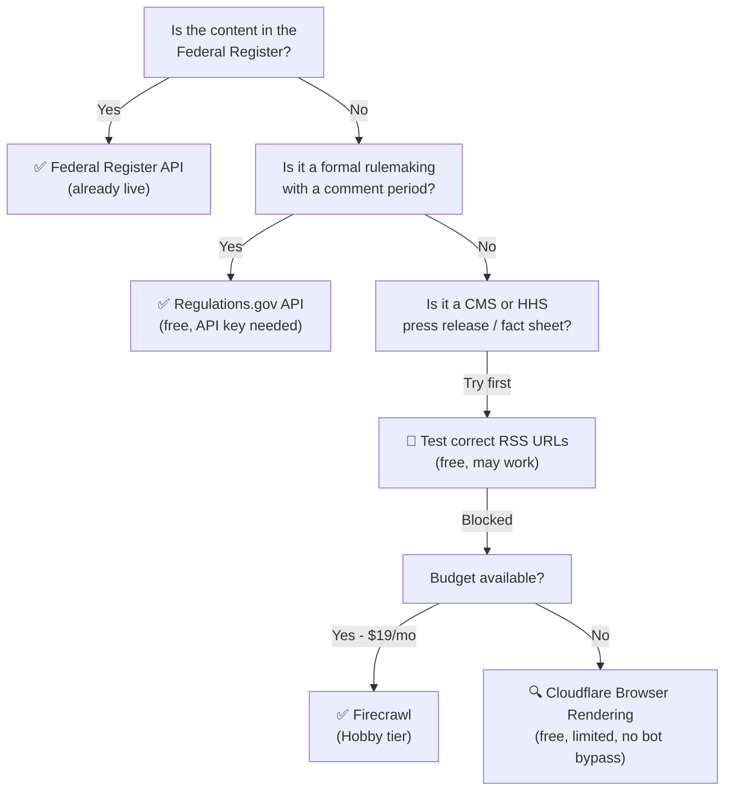

# Regulatory Ingestion: Options Research

*Written: 2026-04-25 — based on full research into Cloudflare solutions, MCPs, and alternatives*

---

## The Problem

The ACIS scraper currently pulls from the **Federal Register API** (confirmed working — 19 items ingested on first run). The original intent was to also pull directly from:

- `cms.gov/newsroom` — Press releases, fact sheets, policy guidance
- `hhs.gov/news` — HIPAA enforcement actions, OCR settlements

Both block automated requests:
- **CMS.gov** returns a Cloudflare Bot Fight Mode challenge page (CMS uses Cloudflare)
- **HHS.gov** returns "Access Denied" (HHS uses Akamai Bot Manager)

The Federal Register covers *formal regulatory actions* — proposed rules, final rules, notices. It does NOT cover press releases, informal guidance, or CMS fact sheets. That's the gap we're trying to fill.

---

## Option 1: Cloudflare Browser Rendering (Native)

**What it is:** `@cloudflare/puppeteer` — Cloudflare runs a headless Chromium browser inside the Worker infrastructure. Also supports `@cloudflare/playwright` (v1.3.0, requires `compatibility_date >= 2025-09-15`).

**wrangler.toml addition:**
```toml
[browser]
binding = "BROWSER"
```

**The verdict: Does NOT solve our problem.**

Cloudflare Browser Rendering is identified as bot traffic by other Cloudflare-protected sites (including CMS.gov). It uses a fixed User-Agent `"CloudflareBrowserRenderingCrawler/1.0"` which is trivially blocked. It cannot solve CAPTCHA or Turnstile challenges. HHS.gov (Akamai) is also not helped — Akamai blocks at the application layer regardless of rendering engine.

**When it IS useful:** Scraping unprotected government data pages, regulatory PDFs, or any site without active bot protection. Worth enabling for scraping `regulations.gov` supplementary pages, GovInfo documents, or EBSA guidance PDFs.

**Pricing:** Free tier = 10 min/day, 3 concurrent browsers. Paid = $5/month base, $0.09/hr beyond 10hrs/month.

---

## Option 2: Firecrawl (Recommended External API)

**What it is:** Managed scraping API with proxy rotation, JavaScript rendering, and bot detection bypassing. Claims 96% web coverage.

**The reason it's the top pick:**

1. **Has an official MCP server** (`firecrawl-mcp`) — meaning it can be wired directly into Claude Code right now, today, for development-time scraping tasks
2. **Handles Cloudflare and Akamai** via rotating proxies and stealth headers (not guaranteed, but the best commercially available option)
3. **Returns LLM-optimized output** — clean markdown, structured JSON, no HTML noise
4. **Direct TypeScript SDK** (`@mendable/firecrawl-js`) works in Cloudflare Workers

**Pricing:**
| Plan | Price | Credits | Per-page cost |
|---|---|---|---|
| Free | $0 | 500 one-time | ~$0.02/page |
| Hobby | $19/mo | 3,000/mo | ~$0.006/page |
| Standard | $99/mo | 100,000/mo | ~$0.001/page |

For ACIS scraping 3 sources × 10 articles/day = 900 pages/month → **Hobby tier ($19/mo) is sufficient.**

**As an MCP server (for development use):**
```json
{
  "mcpServers": {
    "firecrawl": {
      "command": "npx",
      "args": ["-y", "firecrawl-mcp"],
      "env": {
        "FIRECRAWL_API_KEY": "fc-YOUR_KEY_HERE"
      }
    }
  }
}
```
Add to `.mcp.json` alongside the existing Cloudflare and GitHub MCPs. From that point, Claude Code can scrape any URL during development — useful for testing what CMS.gov newsroom actually contains.

**As a Worker integration:**
```typescript
import FirecrawlApp from '@mendable/firecrawl-js';

const app = new FirecrawlApp({ apiKey: env.FIRECRAWL_API_KEY });
const result = await app.scrapeUrl('https://www.cms.gov/newsroom', {
  formats: ['markdown'],
  onlyMainContent: true,
});
```

---

## Option 3: CMS RSS Feeds (Correct URLs — May Already Work)

This is the most important finding from the research. We used *wrong RSS URLs* in the first scraper attempt. The correct CMS feed index is:

- **Feed index:** `https://www.cms.gov/newsroom/rss-feeds`
- **Press Releases:** `https://www.cms.gov/newsroom/press-releases` (may have RSS at `/feed`)
- **Fact Sheets:** `https://www.cms.gov/newsroom/fact-sheets` (same)

These *specific sub-page RSS feeds* may be served differently than the main site and may not trigger Bot Fight Mode. **This should be the first thing we test** — it's free and requires no external service.

Similarly for HHS:
- `https://www.hhs.gov/guidance/document/rss-feeds-and-podcasts`

Worth a targeted test from inside a Worker (`wrangler dev`) to see if these specific URLs return XML vs. HTML challenge pages.

---

## Option 4: Regulations.gov API (Free, High Signal)

**What it is:** The federal rulemaking public comment portal. Covers CMS and HHS rulemaking documents that are in active comment periods — exactly the high-risk, high-urgency items a compliance administrator needs to track.

**Authentication:** Free API key from `api.data.gov` (sign-up takes 2 minutes)

**Endpoint:**
```
https://api.regulations.gov/v4/documents?filter[agencyId]=CMS&limit=25
```

**Why it matters for this portfolio:** Regulations.gov documents in open comment periods are the items where a compliance administrator must take action by a deadline. A regulatory event with a comment deadline is more urgent than a final rule. This complements Federal Register perfectly.

**Rate limits:** Standard key = 1,000 req/hour. More than enough.

---

## Option 5: Bright Data (Best for Akamai)

If HHS.gov access becomes critical, Bright Data's **Web Unlocker** specifically targets Akamai Bot Manager using TLS fingerprinting and real browser simulation. It's the most reliable commercial option for Akamai-protected sites.

- **Free trial:** $500 in credits
- **Web Unlocker:** ~$3–$5 per 1,000 requests
- **Verdict:** Overkill for development; only worth enabling if HHS.gov press releases are a hard requirement for the demo. The regulations.gov API and Federal Register API should cover the compliance intelligence angle adequately.

---

## Option 6: ScrapingBee

Good Cloudflare bypass with `stealth_proxy: true` + `render_js: true`. $49/month for 250,000 credits. More appropriate for CMS.gov than Bright Data (which is optimized for Akamai). However, at $49/mo vs. Firecrawl Hobby at $19/mo for our volume, Firecrawl wins on price and has the MCP integration advantage.

---

## Option 7: Email Routing (Novel, Low Priority)

Cloudflare Email Routing can receive forwarded email and trigger a Worker via the `email` handler. CMS and HHS both offer email subscription lists. If those emails are forwarded to a Cloudflare-routed address, a Worker can parse them with `postal-mime` and insert them into D1.

**Why it's interesting:** Zero bot detection issues (you're receiving email, not scraping), near-real-time delivery, human-readable content.

**Why it's low priority:** Requires manual subscription setup, email timing is unpredictable, and RSS/API sources are more reliable for structured ingestion.

---

## Decision Matrix



---

## Recommended Action Plan

### Immediate (free, today):
1. **Test the correct CMS RSS feed URLs** from within `wrangler dev` — if they work, this is the cleanest solution
2. **Add `regulations.gov` as a fourth source** in the scraper — free API key, high-signal content (comment deadlines)

### Short-term ($0 setup cost):
3. **Add Firecrawl MCP to `.mcp.json`** — even without paying, the MCP gives us scraping capability during development to inspect what CMS.gov newsroom returns and understand its structure

### If CMS/HHS direct access remains a requirement:
4. **Sign up for Firecrawl free tier** (500 credits) and test against `cms.gov/newsroom` — if it works, upgrade to Hobby ($19/mo)
5. Consider Bright Data trial only if HHS.gov Akamai-protected content is essential

### What we already have that's excellent:
The **Federal Register API + EBSA** combination is genuinely the most authoritative source for compliance-relevant regulatory actions. For a demo, real Federal Register documents are more credible than scraped press releases — they're the actual regulatory text that compliance administrators must respond to.

---

## Context for the Portfolio Demo

The hiring manager (IT Director) will be most impressed by:
1. Real regulatory content from authoritative federal sources ✓ (Federal Register — done)
2. Visible AI reasoning about compliance risk ✓ (Claude scoring — done)
3. Actionable remediation steps with deadlines (Regulations.gov adds deadline data)

A CMS press release on the dashboard is "nice to have" but the Federal Register entries covering the same regulatory actions are what a real compliance administrator actually tracks. The current setup is already demo-ready; the options above are improvements, not blockers.
