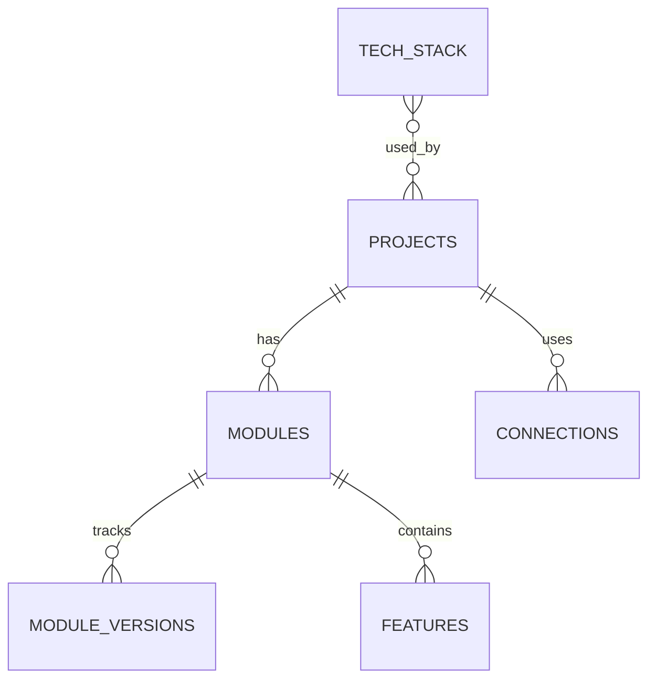
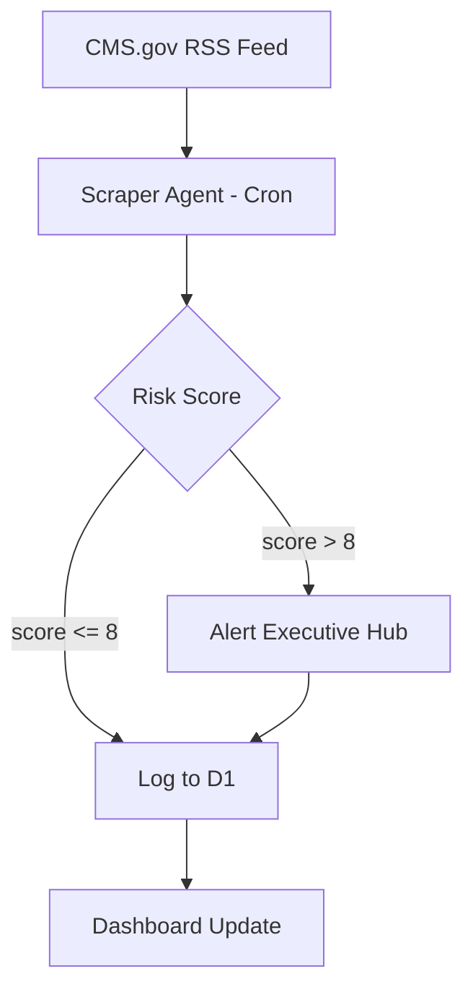
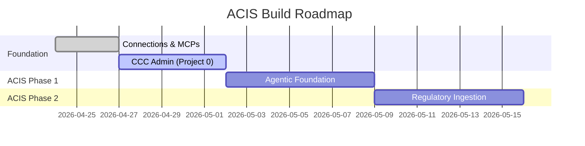
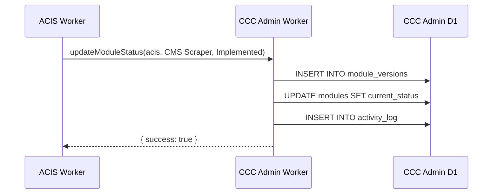

# Visual Representation Guide for CCC Projects

*Reference: when to use what for diagrams, schemas, and architecture docs*

---

## The Problem With Markdown Tables

Markdown tables work fine in a rendered preview but fall apart in raw view, don't handle complex relational data well, and can't express connections between entities. For a project built around a multidimensional relational system, we need better tools.

---

## The Toolkit

### 1. Mermaid Diagrams — Primary Choice

Mermaid is the default for anything structural or relational. It renders natively in:
- **GitHub** (any `.md` file in a repo)
- **Cursor** (Markdown preview mode)
- **Cloudflare Pages** (with a Mermaid JS library included)
- **Notion, Obsidian, GitBook** and most modern doc tools

Written directly inside a markdown code block with ` ```mermaid `:

---

**Entity-Relationship Diagrams** — for database schemas



**Use for:** D1 schema visualization, CCC Admin data model, any relational structure.

---

**Flowcharts** — for architecture and data flow



**Use for:** Worker logic flows, agent decision trees, system architecture overviews.

---

**Gantt Charts** — for roadmaps and phase planning



**Use for:** Phase planning, delivery timelines, roadmap visualization.

---

**Sequence Diagrams** — for inter-service communication



**Use for:** Service binding flows, API interactions, agent communication patterns.

---

### 2. ASCII Trees — For Directory and Hierarchy Views

Best for project structure, folder trees, and simple hierarchies. Already in use in this project and reads well in raw text.

```
compliance-portfolio/
├── CLAUDE.md
├── brainstorming/
│   ├── ACIS_synthesis_and_thoughts.md
│   ├── CCC_meta_system_thoughts.md
│   ├── foundation_checklist.md
│   └── visual_tools_guide.md        ← this file
└── projects/
    └── 01-regulatory-pulse-dashboard/
        └── CHARTER.md
```

**Use for:** File/folder structures, component hierarchies, simple parent-child relationships.

---

### 3. HTML with Inline CSS — For Rich Documents

When a document will be viewed in a browser (e.g., via Cloudflare Pages or a GitHub Pages doc site), full HTML tables and styled layouts are appropriate. Not for `.md` files — reserved for actual dashboard/frontend work.

**Use for:** The CCC Admin dashboard views, Executive Hub panels, any rendered web output.

---

### 4. Lucidchart / Excalidraw — For Whiteboard Sessions

When the architecture is still being explored and you want a freeform visual:
- **Excalidraw** (`excalidraw.com`) — hand-drawn style, great for early-stage architecture sketches. Has a VS Code/Cursor extension.
- **Lucidchart** — more formal, good for sharing with non-technical stakeholders.

These are external tools — exports can be saved as images in the `brainstorming/` folder.

**Use for:** Early conceptual diagrams before the architecture is firm enough to write as Mermaid.

---

## Decision Guide

| Situation | Best Tool |
|---|---|
| Database schema / ER diagram | Mermaid `erDiagram` |
| System architecture / data flow | Mermaid `flowchart` |
| Phase timeline / roadmap | Mermaid `gantt` |
| API / service communication | Mermaid `sequenceDiagram` |
| Folder / project structure | ASCII tree |
| Dashboard UI / web output | HTML + CSS |
| Early exploratory brainstorm | Excalidraw |
| Simple flat reference (small) | Markdown table (acceptable) |

---

## Action Item

When we write the CCC Admin schema documentation, replace the SQL block + markdown table combo with:
1. Mermaid `erDiagram` for the entity relationships
2. A Mermaid `flowchart` for how project Workers report status to the Admin
3. A Mermaid `gantt` for the full build sequence (Foundation → CCC Admin → ACIS → future projects)

This will be the visual standard for all CCC project documentation going forward.
